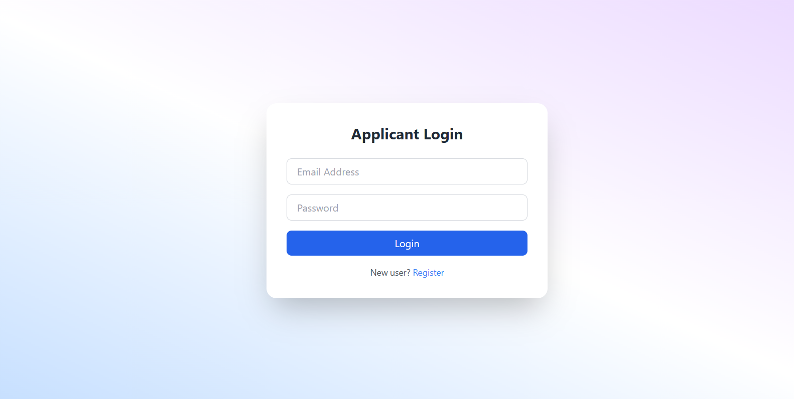

# Assessment Task Module (MERN Stack)
A web-based assessment system built using the MERN Stack (MongoDB, Express.js,React.js, Node.js)

# Features

# Admin Panel
- create assessments with title, description, and time limit
- Add multiple choice qestions with options and correct answers
- set marks per qestion
- View number of applicant who attempted each test

# Applicant Portal
- View list of available assessments with title and duration
- Start and attempt tests within time limit 
- Timer countdown per test 
- Auto-submit when time expires
- Navigate between questions
- Insatnt result calculation and display

# Teck Stack
- React.js            -> Frontend UI(Hooks based)
- Tailwind CSS        -> Style
- Node.js             -> Backend server
- Express.js          -> API development
- MongoDB Atlas       -> Databse
- JWT                 -> Authentication & Authorization
- REST API            -> Communication between client & server

# Folder Structure
client/  -> React frontend

------ src/
---------components/
---------pages/
---------App.jsx

server/  -> Node.js + Express backend
------- controllers/
------- models/
------- routes/
------- server.js

# Installation 
- client
npm create vite@latest

npm install

- server
npm init -y

npm install

# Run the project
- cd server  -> npm start
- cd client  -> npm run dev

# Sreenshots
- Home Page

- Admin Page

- Manage Assesmnet

- Applicant Page

- Result Page

